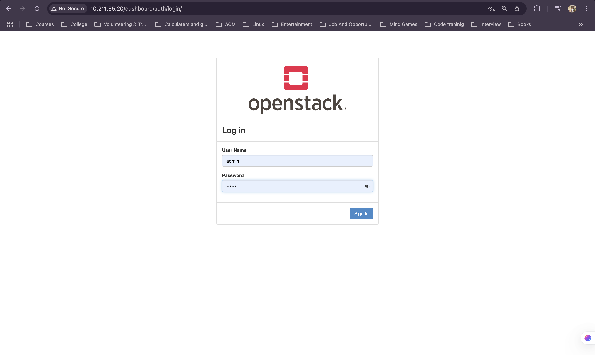
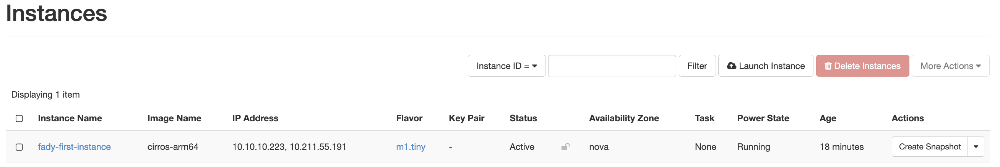
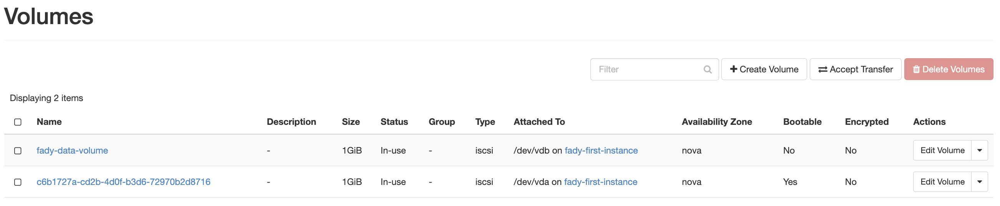

# 🚀 OpenStack Installation Guide with Packstack

This guide walks you through installing OpenStack using the Packstack installer. Follow the steps to set up your cloud environment efficiently.

---

## 📌 Prerequisites

Ensure the following before starting the installation:

✅ A Virtual Machine with:
- **RAM**: 12 GB  
- **CPU**: 2 Cores  
- **Disk**: 25 GB  
- **NICs**: 2  

✅ **Operating System**: Rocky Linux 9  
✅ **Virtualization enabled** on the host  
✅ **Static IP configuration** for the NICs, and **IPv6 disabled**  

**⚠️ Note:** Most of the commands in this guide require **root (sudo) privileges**. Ensure you run them as `sudo` or switch to the root user.

---

## 🏗️ Step 1: Preparing the Host

### 🔹 1.1 Hardware Setup
- **Download Rocky 9 ISO**:  
  🔗 [Rocky 9 ISO](https://azza-permanent.oss.prod-cloud-ocb.orange-business.com/Rocky-9.4-x86_64-dvd.iso)

- **Create a Virtual Machine**

- **Install the OS, configure two NICs with static IPs, disable IPv6, and **reboot** the system.**

### 🔹 1.2 Validate Environment
- **Check Internet Connectivity**:
  ```bash
  ping 8.8.8.8
  ```
- **Verify NIC Static IP Configuration**:
  ```bash
  cat /etc/NetworkManager/system-connections/ens160.nmconnection
  cat /etc/NetworkManager/system-connections/ens192.nmconnection
  ```

---

## 🔧 Step 2: Configuring the Host

- **Disable Firewall**:
  ```bash
  systemctl disable firewalld
  systemctl stop firewalld
  ```
- **Disable SELinux**:
  ```bash
  setenforce 0
  sed -i 's/SELINUX=.*/SELINUX=disabled/' /etc/selinux/config
  ```
- **Set Hostname & Update `/etc/hosts`**:
  ```bash
  hostnamectl set-hostname controller
  echo "<IP> controller" >> /etc/hosts
  ```

---

## 📦 Step 3: Installing OpenStack

- **Enable OpenStack Repositories & Install Packages**:
  ```bash
  dnf config-manager --enable crb
  dnf install -y centos-release-openstack-antelope
  dnf -y update && reboot
  ```
- **Install Packstack**:
  ```bash
  dnf install -y openstack-packstack
  ```

---

## 🏗️ Step 4: Deploying OpenStack

- **Generate & Customize Answer File**:
  ```bash
  packstack --gen-answer-file=/root/answers.txt
  ```
  Modify the file to configure OpenStack services and networking.

- **Run Packstack Installation**:
  ```bash
  packstack --answer-file=/root/answers.txt
  ```

---

## ✅ Step 5: Validating Installation

- **Check OpenStack Services**:
  ```bash
  systemctl list-units --type=service | grep openstack
  ```


- **List Storage Devices**:
  ```bash
  lsblk
  ```


- **Verify Network Interfaces**:
  ```bash
  ip a
  ```


- **Access the OpenStack Dashboard**: 🌍 Open the browser and enter the dashboard IP.


---

## 🔑 Step 6: Configuring OpenStack Authentication

#### To ensures you have the necessary permissions to interact with OpenStack services:

- **Source the Admin Credentials**:
  ```bash
  source keystonerc_admin
  ```
- **Verify authentication**:
  ```bash
  openstack token issue
  ```

---

## 🌐 Step 7: Setting Up Networking

- **Create Provider Network**:
  ```bash
  openstack network create --share --external --provider-network-type flat --provider-physical-network provider provider
  ```
- **Create Subnet for Provider Network**:
  ```bash
  openstack subnet create --network provider --allocation-pool start=192.168.1.100,end=192.168.1.200 --dns-nameserver 8.8.8.8 --gateway 192.168.1.1 --subnet-range 192.168.1.0/24 provider-subnet
  ```
- **Create Private Network**:
  ```bash
  openstack network create selfservice
  ```
- **Create Private Subnet**:
  ```bash
  openstack subnet create --network selfservice --dns-nameserver 8.8.8.8 --gateway 192.168.2.1 --subnet-range 192.168.2.0/24 selfservice-subnet
  ```
- **Create Router & Connect Networks**:
  ```bash
  openstack router create my-router
  openstack router set my-router --external-gateway provider
  openstack router add subnet my-router selfservice-subnet
  ```
- **Assign Floating IP**:
  ```bash
  openstack floating ip create provider
  openstack server add floating ip <instance-name> <floating-ip>
  ```


---

## 🖥️ Step 8: Deploying Instances

- **Upload Image**:
  ```bash
  curl -L http://download.cirros-cloud.net/0.3.4/cirros-0.3.4-x86_64-disk.img | glance image-create --name='cirros' --visibility=public --container-format=bare --disk-format=qcow2
  ```
- **Launch VM Instance**:
  ```bash
  openstack server create --flavor m1.small --image cirros --nic net-id=<network-id> --security-group default --key-name mykey my-instance
  ```
- **Attach Additional Storage**:
  ```bash
  openstack volume create --size 10 my-volume
  openstack server add volume my-instance my-volume
  ```



---

## 🎨 Step 9: Customizing Dashboard

- **Change OpenStack Logo**:
  ```bash
  cd /usr/share/openstack-dashboard/static/dashboard/img/
  mv logo-splash.svg logo-splash.svg.bkp
  cp <your_img_path> logo-splash.svg
  chmod 644 logo-splash.svg
  ```
